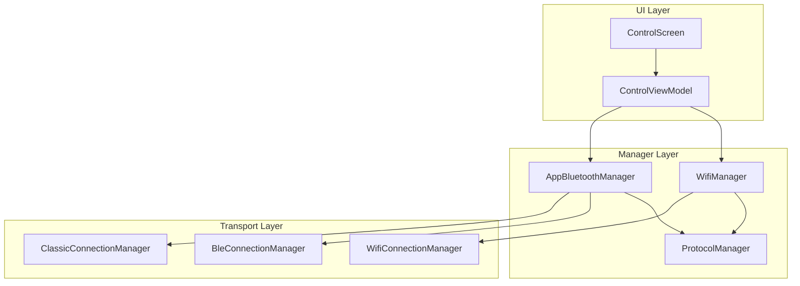
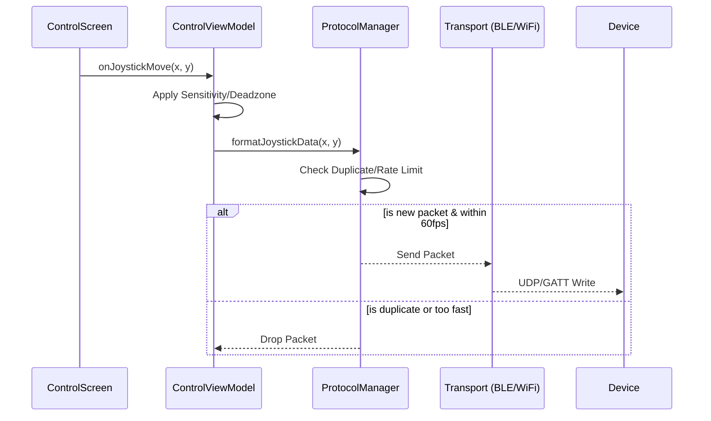

# Ardunakon Architecture

## Overview
Ardunakon is a native Android application designed to control Arduino-based robotics projects via Bluetooth Classic, BLE, and WiFi. It uses a clean, reactive architecture based on MVVM (Model-View-ViewModel) and Jetpack Compose.

## Key Architectural Patterns

### Dependency Injection (Hilt)
The application uses **Hilt** for compile-time dependency injection.
- **Entry Points**: `ArdunakonApplication` (`@HiltAndroidApp`) and `MainActivity` (`@AndroidEntryPoint`).
- **Modules**:
  - `AppModule`: Provides system services (Context, Resources).
  - `BluetoothModule`: Provides `AppBluetoothManager` (Singleton coordinator).
  - `WifiModule`: Provides `WifiManager`.
  - `DataModule`: Provides repositories (`ProfileManager`, `DeviceNameCache`).
- **ViewModels**: `ControlViewModel` is injected with `@HiltViewModel`.

### Coordinator Pattern (`AppBluetoothManager`)
To solve the "God Class" problem, the Bluetooth logic is split using a Coordinator pattern:
- **`AppBluetoothManager`**: The central coordinator. It exposes unified `StateFlows` to the UI but delegates actual work.
- **`ClassicConnectionManager`**: Handles Bluetooth Classic sockets.
- **`BleConnectionManager`**: Handles BLE scanning, GATT connections, and characteristic writes.
- **`TelemetryManager`**: Parses incoming data streams into `Telemetry` objects.
- **`BluetoothScanner`**: Handles device discovery.

### MVVM & State Management
- **UI (Compose)**: `ControlScreen` is stateless and reactive. It observes `StateFlows` from the ViewModel and Managers.
- **ViewModel**: `ControlViewModel` handles business logic, user input processing (joystick formatting), and mode switching (WiFi vs Bluetooth).

### Protocol Layer (`ArdunakonProtocol`)
A shared library (C++) is used on the Arduino side, while the Android app implements the protocol in `ProtocolManager`.
Format: `STX | JOY_X | JOY_Y | SERVO_X | SERVO_Y | AUX | CHECKSUM | ETX`

## Data Flow
1. **Input**: User moves joystick on `ControlScreen`.
2. **ViewModel**: `ControlViewModel` receives coordinates, normalizes them based on `Profile` sensitivity.
3. **Protocol**: Format packet in `ProtocolManager`.
4. **Transport**:
   - If **Bluetooth**: `AppBluetoothManager` -> `Classic/BleManager` -> `BluetoothSocket`/`Gatt`.
   - If **WiFi**: `WifiManager` -> `DatagramSocket` (UDP).

## Security
- **WiFi Encryption**: R4 WiFi connections use an encrypted handshake (Challenge-Response) with a pre-shared key (PSK).
- **Profile Encryption**: Joystick profiles are stored in encrypted JSON files using Android's `EncryptedFile` (Jetpack Security).

## System Diagrams

### Component Overview

### Data Flow (Control Loop)

## Performance Optimizations

1. **Network Efficiency**:
   - **Duplicate Suppression**: Joystick packets are only sent if data has changed.
   - **Rate Limiting**: Commands capped at 60fps to prevent saturation.
   - **BLE 5.0 PHY**: Uses 2M PHY for faster data transfer when supported.
   - **MTU Optimization**: Negotiates 517-byte MTU for BLE throughput.

2. **Battery Optimization**:
   - **Adaptive Monitoring**: Heartbeat and RSSI polling intervals increase when app is backgrounded.
   - **Keep-Alive Tuning**: WiFi heartbeats adjust based on RTT (1.5s - 5s).

3. **Memory Management**:
   - **O(1) Buffers**: Uses `ArrayDeque` for telemetry and log history.
   - **Time-based Cleanup**: `TelemetryHistoryManager` automatically prunes data older than 10 minutes.

## Testing Strategy
- **Unit Tests**: Business logic in managers and protocol.
- **UI Tests**: Instrumented tests using Hilt + Compose Rule. Mocks (`FakeBluetoothModule`) replace hardware interfaces.
