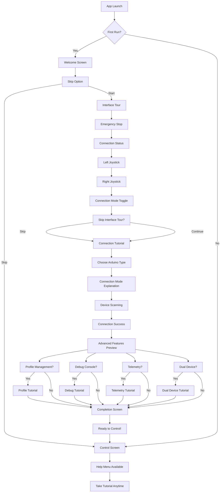

# Ardunakon Onboarding Flow - Executive Summary

## Overview
A comprehensive onboarding system designed to transform the Ardunakon app experience from overwhelming to intuitive, using progressive disclosure and user choice.

## Current Problem
Users currently "drop directly into control screen" with complex interface featuring:
- Multiple connection modes (Bluetooth/WiFi)
- Dual joysticks and servo controls  
- Debug panels and telemetry
- Advanced features hidden in menus
- No guidance on Arduino hardware setup

## Solution: Progressive Onboarding Flow

### Flow Diagram


## Key Design Principles

### 1. Progressive Disclosure
- **Start Simple**: Show only essential controls first
- **User Choice**: Let users decide how deep to go
- **Optional Deep Dives**: Advanced features available but not forced

### 2. Safety First
- **Emergency Stop First**: Most important feature highlighted immediately
- **Connection Verification**: Ensure users can successfully connect before proceeding
- **Clear Status Indicators**: Easy to understand connection state

### 3. Multiple Learning Paths
- **Beginners**: Full walkthrough with hardware setup guidance
- **Experienced**: Quick interface overview, skip to connection
- **Mixed**: Basic tour, optional advanced features

### 4. Contextual Help
- **Embedded Guidance**: Help available exactly when needed
- **Help Menu Integration**: Tutorial accessible from Help anytime
- **Hardware Setup Links**: Direct links to setup guides for each Arduino type

## Onboarding Phases

### Phase 1: Welcome & Orientation (30 seconds)
**Goal**: Set expectations and offer choice
- Value proposition with key benefits
- Time estimate to manage expectations  
- Clear skip option with tutorial access guarantee

### Phase 2: Essential Interface Tour (60 seconds)
**Goal**: Orient user to core controls
- Emergency Stop (safety critical)
- Connection Status (feedback essential)
- Left Joystick (primary movement)
- Right Joystick (throttle/servos)
- Connection Mode Toggle (Bluetooth ↔ WiFi)

### Phase 3: Connection Tutorial (90 seconds)
**Goal**: Get user successfully connected
- Arduino type selection with visuals
- Connection mode explanation (when to use each)
- Device scanning and selection
- Connection success verification

### Phase 4: Advanced Features (Optional - 30 seconds each)
**Goal**: Introduce powerful features progressively
- Profile Management (settings saving)
- Debug Console (troubleshooting)
- Telemetry & Monitoring (battery, signal)
- Dual Device Control (advanced use cases)

### Phase 5: Completion & Next Steps (30 seconds)
**Goal**: Celebrate success and provide direction
- Recap of covered features
- Links to example projects
- Help menu integration reminder

## Technical Implementation

### Architecture
```
MainActivity
├── OnboardingFlow (conditional on first run)
│   ├── WelcomeScreen
│   ├── InterfaceTour  
│   ├── ConnectionTutorial
│   ├── AdvancedFeatures (optional)
│   └── CompletionScreen
└── ControlScreen (normal app flow)
```

### State Management
- **SharedPreferences**: Track onboarding completion and version
- **Progressive Steps**: Users can resume where they left off
- **Help Integration**: Tutorial accessible from Help menu anytime

### UI Components
- **OnboardingOverlay**: Highlight target elements with tutorials
- **TutorialCard**: Consistent content presentation
- **Progress Indicators**: Show tutorial completion status

## Benefits

### For Users
- **Reduced Overwhelm**: Complex interface becomes approachable
- **Faster Success**: Time to first connection reduced from minutes to seconds
- **Feature Discovery**: Advanced features no longer hidden
- **Flexible Learning**: Skip what you know, dive deep on what you need

### For the App
- **Lower Support Burden**: Fewer "how do I connect?" questions
- **Higher Engagement**: Users discover and use more features
- **Better Retention**: Positive first experience
- **Accessibility**: Screen reader support and keyboard navigation

### For Developers
- **Modular Design**: Easy to update individual tutorial steps
- **Analytics Ready**: Track which features users engage with
- **Maintainable**: Tutorial content mirrors help documentation

## Success Metrics

### Engagement
- **70%+ Tutorial Completion Rate** for first-time users
- **<3 Minutes Time to First Connection** for new users
- **>50% Help Menu Tutorial Access** for users who skip initially

### User Experience
- **Decreased "I'm lost" Feedback** in app reviews
- **Reduced Connection Failure Rate** for new users
- **Increased Feature Discovery** (profiles, telemetry usage)

### Technical
- **No Impact on App Startup Time** with async loading
- **Minimal Memory Overhead** through efficient overlay system
- **Tutorial State Persistence** across app restarts

## Implementation Timeline

### Week 1-2: Design & Content
- Create visual mockups for each tutorial step
- Write copy and prepare assets
- Finalize UI specifications

### Week 3-4: Core Development
- Build reusable onboarding components
- Implement welcome screen and basic flow
- Integrate with MainActivity

### Week 5: Advanced Features
- Connection tutorial implementation
- Advanced features preview system
- Help menu integration

### Week 6: Testing & Refinement
- User testing with target audience
- Performance optimization
- Accessibility testing

### Week 7: Launch Preparation
- Documentation updates
- Analytics integration
- Gradual rollout planning

## Content Strategy

### Copy Guidelines
- **Concise**: Maximum 10 words per explanation
- **Actionable**: Focus on what to do, not theory
- **Encouraging**: Positive reinforcement throughout
- **Contextual**: Explain why, not just how

### Visual Design
- **Minimal Distraction**: Semi-transparent overlays (70% opacity)
- **Clear Hierarchy**: Important elements highlighted first
- **Consistent Styling**: Match app's dark theme
- **Mobile-First**: Optimized for phone screens

### Accessibility
- **Screen Reader Support**: Descriptive content for all steps
- **Keyboard Navigation**: Tab order through tutorial controls
- **High Contrast**: Support for system accessibility settings
- **Touch Targets**: Minimum 44dp for all interactive elements

## Risk Mitigation

### User Frustration
- **Skip Anytime**: Always available escape route
- **Resume Later**: State preserved if app closed
- **Quick Exit**: Tap outside to close overlays

### Technical Issues
- **Graceful Fallback**: Tutorial fails to basic help if needed
- **Performance**: Disable animations on low-end devices
- **Compatibility**: Test across Android versions

### Content Maintenance
- **Version Tracking**: Update tutorial when UI changes
- **Modular Content**: Easy to update individual steps
- **Help Integration**: Tutorial always mirrors current documentation

## Integration Points

### Existing App Flow
- **MainActivity**: Conditional onboarding display
- **ControlScreen**: Overlay system for guided tours
- **Help Menu**: "Take Tutorial" option integration

### New Components
- **OnboardingManager**: State management and preferences
- **TutorialOverlay**: Reusable highlighting system
- **Help Integration**: Seamless access from help menu

### Data Flow
- **SharedPreferences**: Track completion status
- **Analytics**: User engagement and completion tracking
- **Crash Reporting**: Tutorial-specific error handling

## Conclusion

This onboarding system transforms Ardunakon from an overwhelming interface to an approachable, guided experience. By using progressive disclosure and user choice, it serves both beginners who need guidance and experienced makers who want quick setup.

The implementation is technically sound, accessibility-focused, and designed for long-term maintainability. It integrates seamlessly with the existing app architecture while providing significant value to users across all experience levels.

**Ready for Implementation**: All specifications, UI mockups, and technical details are provided for immediate development start.