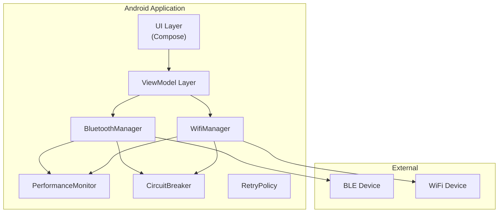
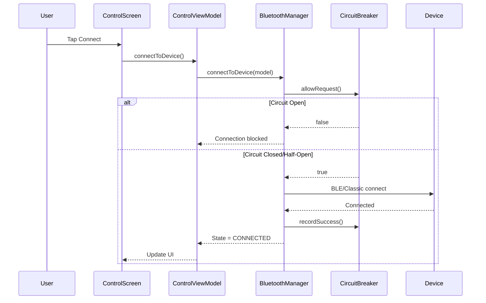
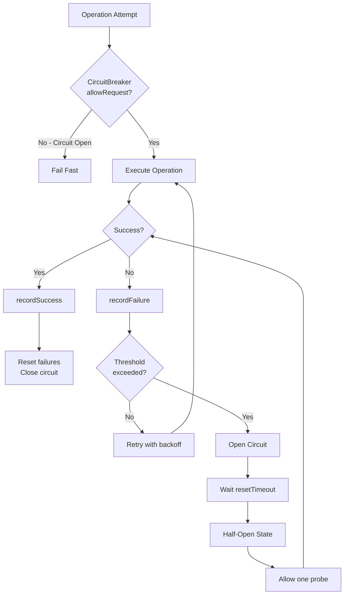
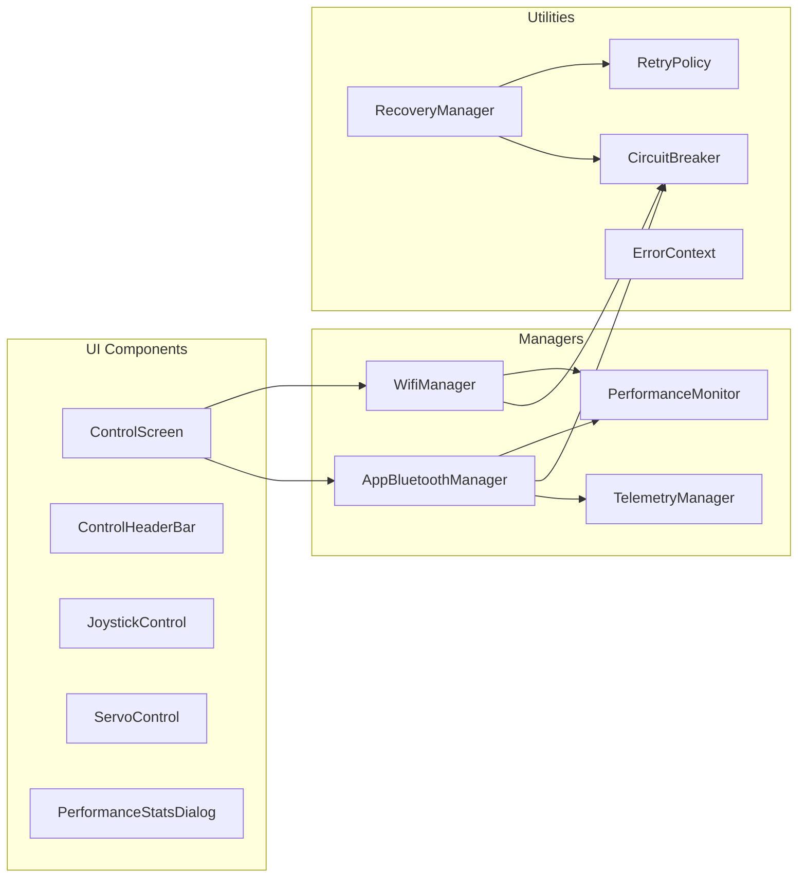
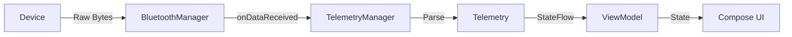
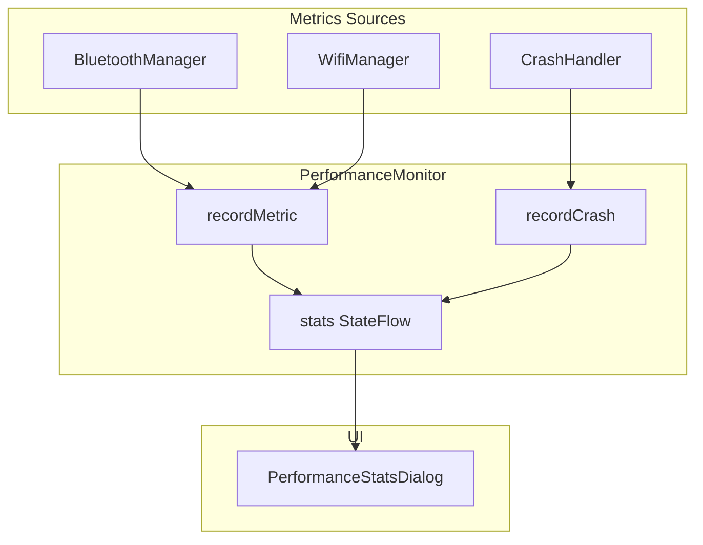

# Ardunakon Architecture Documentation

This document provides component diagrams and data flow documentation for the Ardunakon Android application.

## System Overview



---

## Connection Flow



---

## Error Recovery Flow



---

## Component Diagram



---

## Data Flow Diagrams

### Telemetry Pipeline



### Health Monitoring



---

## Algorithm Documentation

### Exponential Backoff (CircuitBreaker)

```kotlin
fun calculateBackoff(attempt: Int): Long {
    // Base formula: baseDelay * 2^attempt
    val exponentialDelay = baseDelayMs * 2.0.pow(attempt)
    
    // Cap at maximum delay
    val cappedDelay = min(exponentialDelay, maxDelayMs)
    
    // Add jitter (0-20% of delay) to prevent thundering herd
    val jitter = (cappedDelay * jitterFactor * random())
    
    return cappedDelay + jitter
}
```

| Attempt | Base Delay | Exponential | With 20% Jitter |
|---------|------------|-------------|-----------------|
| 0 | 1000ms | 1000ms | 1000-1200ms |
| 1 | 1000ms | 2000ms | 2000-2400ms |
| 2 | 1000ms | 4000ms | 4000-4800ms |
| 3 | 1000ms | 8000ms | 8000-9600ms |
| 4 | 1000ms | 16000ms | 16000-19200ms |

### Circuit Breaker State Machine

| Current State | Event | Next State | Action |
|---------------|-------|------------|--------|
| CLOSED | Failure count < threshold | CLOSED | Increment counter |
| CLOSED | Failure count ≥ threshold | OPEN | Block requests |
| OPEN | Request (timeout not elapsed) | OPEN | Fail fast |
| OPEN | Request (timeout elapsed) | HALF_OPEN | Allow probe |
| HALF_OPEN | Success | CLOSED | Reset counters |
| HALF_OPEN | Failure | OPEN | Restart timeout |

---

## Interface Contracts

### IBluetoothManager

Core connectivity contract with 21 members:
- **State Flows**: `connectionState`, `scannedDevices`, `rssiValue`, `health`, `telemetry`, `rttHistory`, `autoReconnectEnabled`, `isEmergencyStopActive`, `connectedDeviceInfo`
- **Operations**: `startScan()`, `stopScan()`, `connectToDevice()`, `disconnect()`, `sendData()`, `reconnectSavedDevice()`
- **Control**: `setEmergencyStop()`, `setAutoReconnectEnabled()`, `resetCircuitBreaker()`, `requestRssi()`

### IWifiManager

WiFi connectivity contract with 15 members:
- **State Flows**: `connectionState`, `scannedDevices`, `isScanning`, `rssi`, `rtt`, `telemetry`, `isEncrypted`
- **Operations**: `startDiscovery()`, `stopDiscovery()`, `connect()`, `disconnect()`, `sendData()`
- **Config**: `setAutoReconnectEnabled()`, `setRequireEncryption()`

### IPerformanceMonitor

Monitoring contract with 12 members:
- **Metrics**: `recordMetric()`, `recordStartupTime()`, `recordLatency()`, `recordMemoryUsage()`
- **Crashes**: `recordCrash()`, `getCrashHistory()`
- **Reporting**: `getStats()`, `generateDiagnosticReport()`
